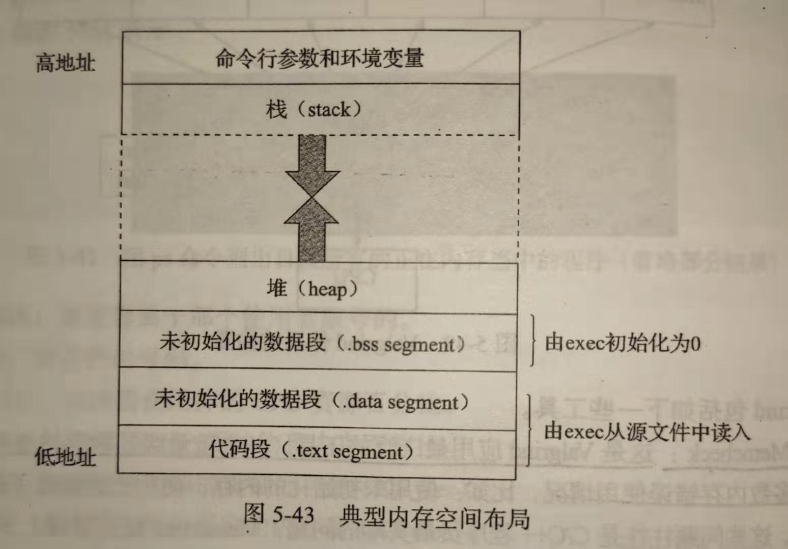

# 第五章

## 5.1 strace

程序通过“系统调用”与操作系统进行交互，完成打开文件等系统级别的操作。系统调用出错不直接返回错误码，而是把错误码放进全局变量`errno`中。可以从`errno`中读出错误码来找出问题所在。

strace是一个通过跟踪系统调用来展示程序在后台所做事情的工具。

**strace用法：**

1. 先用语句`g++ -o test test.cpp`编译得到可执行文件test
2. 再用strace调用可执行文件`strace ./test`就能看到整个执行过程用到的系统调用。
3. 加上参数`-c`可以统计用到的系统调用。`strace -c ./test`


## 5.2 gdb

gdb是gcc的调试工具，用来调试C和C++程序。

**gdb用法：**

1. 编译时加上参数`-g`来将调试信息加到可执行文件中`gcc -g test.c -o test`
2. 启动gdb: `gdb ./test`

调试过程中有很多命令，比如`b 16`代表在第16行的位置设置断点等等，这些命令都略过。


## 5.3 top

top是linux下的一个实时动态显示系统所有进程的资源占有情况的性能分析工具。

- 第一行，系统时间。
- 第二行，进程数。
- 第三行，CPU使用情况，其中`%id`代表空闲CPU百分比，反映了系统cpu的闲忙程度。
- 第四行，内存使用情况，其中`free`代表空闲内存总量。
- 。。。


## 5.4 ps

静态显示当前时刻的进程情况。

ps用法：

1. `ps -u zhongzhanhui`显示指定用户的进程信息。

2. `ps -ef`展示所有进程的信息。

3. `ps -ef | grep python`查找特定进程python。这是最好用的命令，可以看到所有用python执行的进程。

   > ```shell
   > zhongzhanhui@amax:~$ ps -ef | grep python
   > zhongzh+    476  76985  9 20:43 pts/11   00:00:08 python sun42_slimmable_stage3.py
   > wangwen+  77390   8838 99 16:10 pts/10   20:02:12 python main.py
   > ```


## 5.5 内存管理



Linux下C程序内存空间组成（从低地址到高地址）：

1. 代码段：存放程序代码
2. 初始化数据段：存放程序中已经初始化的全局变量（or static 静态变量）
3. 未初始化数据段：存放程序中未初始化的全局变量（or static 静态变量）
4. 堆：存放程序运行中被动态分配的内存段
5. 栈（or堆栈）：存放程序的局部变量，函数调用过程中的传递参数和返回值

堆与栈的区别：

| -----          | 栈                                                           | 堆                                                           |
| -------------- | ------------------------------------------------------------ | ------------------------------------------------------------ |
| 申请方式       | 系统自动分配                                                 | 程序员自己申请                                               |
| 申请后系统响应 | 栈剩余空间足够则分配内存，否则报栈溢出异常                   | os有一个记录空闲内存地址的链表，系统寻找链表中第一个满足申请空间大小的空闲内存块，分配给程序，并且在此内存块的首地址记录本次分配的大小（供以后delete时使用） |
| 大小限制       | 连续内存，由高地址向低地址扩展。栈顶地址和栈的最大容量固定。 | 不连续内存，由低地址向高地址扩展。堆大小由系统中有效的虚拟内存容量决定 |
| 申请效率       | 快                                                           | 慢，容易产生内存碎片                                         |

程序在内存中的分配情况（就是上面那副图）：

1. 函数参数、局部变量都在栈顶分布，向低地址扩展。
2. 函数代码、全局变量、静态变量都在内存低地址处，而malloc分配的堆处于这些内存上面，向高地址扩展。

动态分配和释放内存：

1. C方式：

   ```C
   double *p;
   p=(double*)malloc(30*sizeof(double)); //返回的是一个指向这块内存的指针
   free(p);
   ```

2. C++方式：

   ```C++
   int *ptr_int = new int;    //  new和delete是成对出现的。
   delete ptr_int；   //  delete是指释放内存。
       
   int *ptr_array = new int[10];
   delete[] ptr_array； // 使用delete[]释放数组内存。
   ```

   

**内存错误使用的情况：**

1. <u>使用未初始化的内存</u>。全局变量和静态变量默认初始化为0，局部变量和动态申请的变量默认初始化为随机值。
2. <u>内存读写越界</u>。访问数组越界、对动态内存的访问超出了申请的内存大小范围等。
3. <u>内存覆盖</u>。C与C++可以直接操作内存，比如strcpy等函数，需要设置源地址和目标地址，二者不能重叠。
4. <u>动态内存管理错误</u>。
   - 用malloc申请就用free释放（C），用new申请就用delete释放（C++）
   - 申请多少内存就释放多少内存。释放少了就是内存泄漏，释放多了就是重复释放（也会报错）
   - 释放后仍读写
5. <u>内存泄漏</u>。程序中动态申请的内存在使用完后没有释放，无法被其他程序访问。