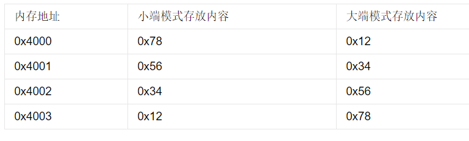

# 第六章

## 6.1 TCP协议

直接看王道考研408的计算机网络部分，比这个更详细，更系统。

## 6.2 TCP网络编程API

网络层的IP地址可以标记一个主机。传输层的“IP地址+端口号”可以标记主机中的一个进程。网络中的进程通信是通过socket来实现的。TCP的交互流程如下 ：

服务端调用listen函数后进入阻塞状态（用while函数），监听客户端的请求。

#### socket函数

socket()用于创建一个socket描述符，它唯一标识一个socket。这个socket没有地址，如果要绑定地址，需要调用bind函数。

#### bind函数

把一个地址（ip地址+端口号）赋给socket。

通常服务器启动时都需要绑定一个众所周知的地址（ip地址+端口号）。而客户端不需要，客户端用connect()函数发送socket请求时，socket的端口号随机分配即可。

#### listen和connect函数

服务端调用listen函数监听socket。

客户端调用connect函数发出连接请求。

#### accept函数

服务端监听到请求后，调用accept函数接受请求，然后连接就建立了，随后开始网络I/O操作。

#### read和write函数 

网络I/O相关的函数 

#### close函数

网络I/O完成后，关闭相应的socket描述符。

## 6.3 实现一个TCP server

代码例子，简单看一下就ok了，还是比较简单的。

## 6.4 TCP协议选项

TCP头部有固定部分20B，有选项部分最多40B。这个小节讲的就是选项部分。

选项部分主要是为了让TCP适应复杂的网络环境的协助功能。

比较复杂，也不是很重要的样子，直接跳过了。

## 6.5 网络字节序和主机序

主机序有两种：

- 小端：数据的低字节放在内存的低地址。
- 大端：数据的高字节放在内存的高地址。（更符合大众思维）。

数据0x12345678的例子：

网络字节序就是大端的字节序，所有网络协议都是采用大端字节序的方式来传输数据。

## 6.6 粘包

TCP建立连接后一直用来传输数据，有可能有粘包问题，就是两段数据的部分放在了同一个TCP包里。

UDP是无连接协议，每段数据都是独立发送的，不会有粘包问题。

粘包问题解决方法：

对数据进行封包（发送端）和拆包（接收端）。即发送端在发送的内容前，加上4B标注发送内容的长度。接收端收到TCP包后根据这个长度进行收包。

## 6.7 本章小结

本章实现的server在同一时刻只能接收一个包，下一章探索如何写高并发的server。